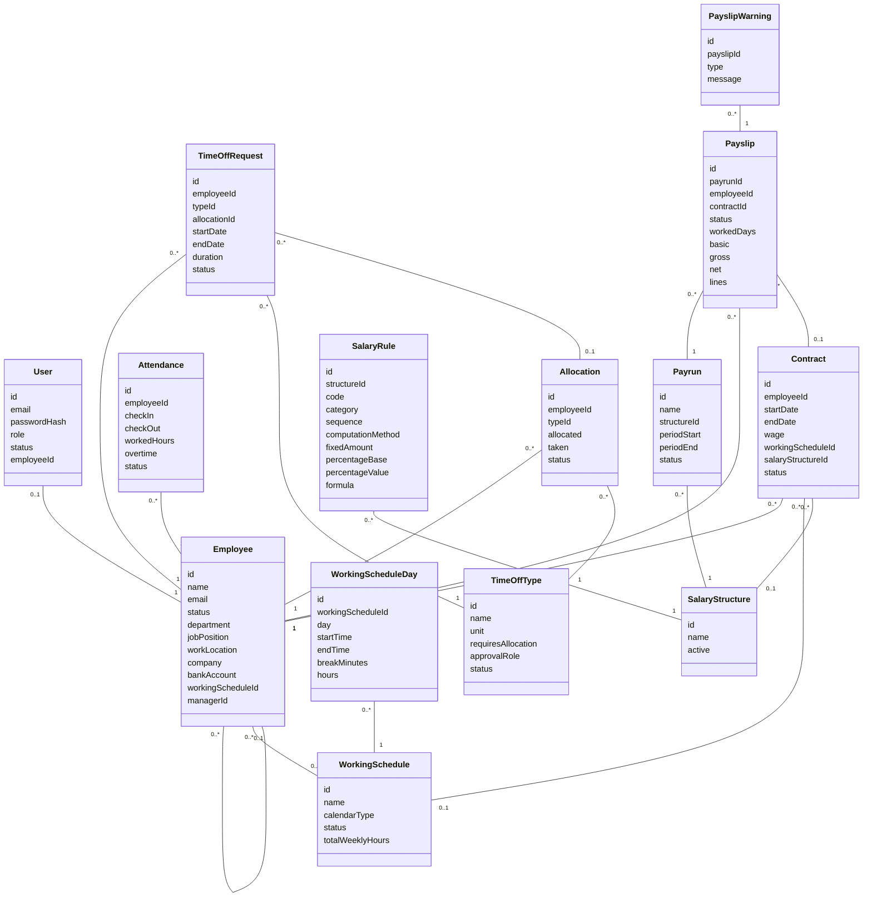

# PeoplePay360 — Schema Class Diagram

Generated directly from `peoplepay360-backend/prisma/schema.prisma` (all Phases 0–6 models). This version leads with a plain-English relationship table — read that first if the diagram's arrows are confusing, then use the diagram just as a visual map.

## How to read this document

- **The table below is the real reference.** It says, for every connection: which model holds the foreign key, what that field is called, which model it points to, and what it means in plain words.
- **The diagram after it is just a visual map** of the same information. In a Mermaid class diagram, an arrow `A --> B` drawn with `"1"` on A's end and `"many"` on B's end means: *one A can relate to many B's*, and the label after the colon is the **field name on the "many" side** that stores the connection. If your Markdown viewer doesn't render Mermaid diagrams, ignore the diagram entirely — the table has everything.

## Relationships, in plain English

| # | Model with the foreign key | Field | Points to | What it means |
|---|---|---|---|---|
| 1 | `User` | `employeeId` | `Employee` | A login account is optionally linked to one Employee (Admin has none). One Employee has at most one User account. |
| 2 | `Employee` | `managerId` | `Employee` (itself) | An employee optionally has one manager, who is also an Employee. One employee can be the manager of many other employees. |
| 3 | `Employee` | `workingScheduleId` | `WorkingSchedule` | An employee is optionally assigned one working schedule. One schedule can be assigned to many employees. |
| 4 | `WorkingScheduleDay` | `workingScheduleId` | `WorkingSchedule` | Each day-row belongs to exactly one schedule. One schedule has many day-rows (e.g. Mon–Fri = 5 rows). Deleting the schedule deletes its days too. |
| 5 | `Contract` | `employeeId` | `Employee` | Every contract belongs to exactly one employee. One employee can have many contracts over time (history). |
| 6 | `Contract` | `workingScheduleId` | `WorkingSchedule` | A contract optionally records which schedule applied to it. One schedule can be used by many contracts. |
| 7 | `Contract` | `salaryStructureId` | `SalaryStructure` | A contract optionally records its "expected" salary structure. One structure can be used by many contracts. (Note: at actual payroll compute time, the *Payrun's* structure is what's really used — see row 15.) |
| 8 | `Attendance` | `employeeId` | `Employee` | Every attendance record belongs to exactly one employee. One employee has many attendance records. |
| 9 | `Allocation` | `employeeId` | `Employee` | Every leave-balance allocation belongs to exactly one employee. One employee can have many allocations (one per leave type, potentially several over time). |
| 10 | `Allocation` | `typeId` | `TimeOffType` | Every allocation is for exactly one leave type (e.g. "Paid Time Off"). One leave type can have many allocations (one per employee). |
| 11 | `TimeOffRequest` | `employeeId` | `Employee` | Every leave request belongs to exactly one employee. One employee can have many requests. |
| 12 | `TimeOffRequest` | `typeId` | `TimeOffType` | Every request is for exactly one leave type. One leave type can have many requests. |
| 13 | `TimeOffRequest` | `allocationId` | `Allocation` | A request optionally consumes balance from one specific allocation (only for leave types that require one). One allocation can be consumed by many requests over time, as long as balance remains. |
| 14 | `SalaryRule` | `structureId` | `SalaryStructure` | Every salary rule belongs to exactly one structure. One structure has many rules (e.g. "Regular Salary" has 12). Deleting the structure deletes its rules too. |
| 15 | `Payrun` | `structureId` | `SalaryStructure` | Every payroll run uses exactly one salary structure for all its payslips. One structure can be used by many payruns over time. |
| 16 | `Payslip` | `payrunId` | `Payrun` | Every payslip belongs to exactly one payrun (the batch it was generated in). One payrun has many payslips (one per selected employee). Deleting the payrun deletes its payslips too. |
| 17 | `Payslip` | `employeeId` | `Employee` | Every payslip belongs to exactly one employee. One employee can have many payslips (one per payroll period they were paid for). |
| 18 | `Payslip` | `contractId` | `Contract` | A payslip optionally records which contract's wage was actually used to compute it — filled in once, at compute time, as a permanent snapshot. One contract can be the source for many payslips (each period it was active for). |
| 19 | `PayslipWarning` | `payslipId` | `Payslip` | Every warning (e.g. "missing bank details") belongs to exactly one payslip. One payslip can have many warnings. Deleting the payslip deletes its warnings too. |

**The three "deleting the parent deletes the children too" cases** (rows 4, 14, 19 — plus row 16's Payrun→Payslip) are the only ones where that automatic cleanup happens. Every other relationship above is just a reference — nothing gets auto-deleted.

## Visual diagram (same information, as a picture)

## Enum reference

Fields typed as an enum can only hold one of these exact values:

| Enum | Values | Used on |
|---|---|---|
| `Role` | `EMPLOYEE`, `HR_MANAGER`, `HR_PAYROLL_USER`, `HR_PAYROLL_MANAGER`, `ADMIN` | `User.role` |
| `UserStatus` | `Active`, `Inactive` | `User.status` |
| `EmployeeStatus` | `Active`, `Inactive` | `Employee.status` |
| `WeekDay` | `MON`, `TUE`, `WED`, `THU`, `FRI`, `SAT`, `SUN` | `WorkingScheduleDay.day` |
| `WorkingScheduleStatus` | `Active`, `Inactive` | `WorkingSchedule.status` |
| `ContractStatus` | `Running`, `Expired` | `Contract.status` |
| `AttendanceStatus` | `Present`, `Absent` | `Attendance.status` |
| `TimeOffUnit` | `Days`, `Hours` | `TimeOffType.unit` |
| `ApprovalRole` | `Manager`, `Officer` | `TimeOffType.approvalRole` |
| `TimeOffTypeStatus` | `Active`, `Inactive` | `TimeOffType.status` |
| `AllocationStatus` | `Pending`, `Approved`, `Refused` | `Allocation.status` |
| `TimeOffRequestStatus` | `Pending`, `Approved`, `Refused` | `TimeOffRequest.status` |
| `SalaryRuleCategory` | `Basic`, `Allowance`, `Gross`, `Deduction`, `Net` | `SalaryRule.category` |
| `SalaryComputationMethod` | `Fixed`, `Percentage`, `Formula` | `SalaryRule.computationMethod` |
| `PercentageBase` | `ContractWage`, `Basic`, `Gross` | `SalaryRule.percentageBase` |
| `PayrunStatus` | `Draft`, `Validated`, `Paid` | `Payrun.status` and `Payslip.status` (a payslip's status always mirrors its parent payrun's) |

## Fields marked "server-computed" — never send these yourself

A few fields exist on models above but are always calculated by the backend, never accepted from a request body:

- `WorkingSchedule.totalWeeklyHours` and `WorkingScheduleDay.hours` — computed from each day's start/end time and break
- `Attendance.workedHours` and `Attendance.overtime` — computed from check-in/check-out against the employee's schedule
- `TimeOffRequest.duration` — computed from start/end date
- `Allocation.taken` — incremented automatically when a request against it is approved
- `Payslip.workedDays`, `basic`, `gross`, `net`, `lines` — filled in by the Payrun's `/compute` step

## Reference

- Source: `peoplepay360-backend/prisma/schema.prisma`
- Full API/business-rule detail per model: `Docs/api/phase-1-employee-user.md` through `Docs/api/phase-6-payroll.md`
- Overall plan and phase status: `Docs/hr-payroll-backend.md`
