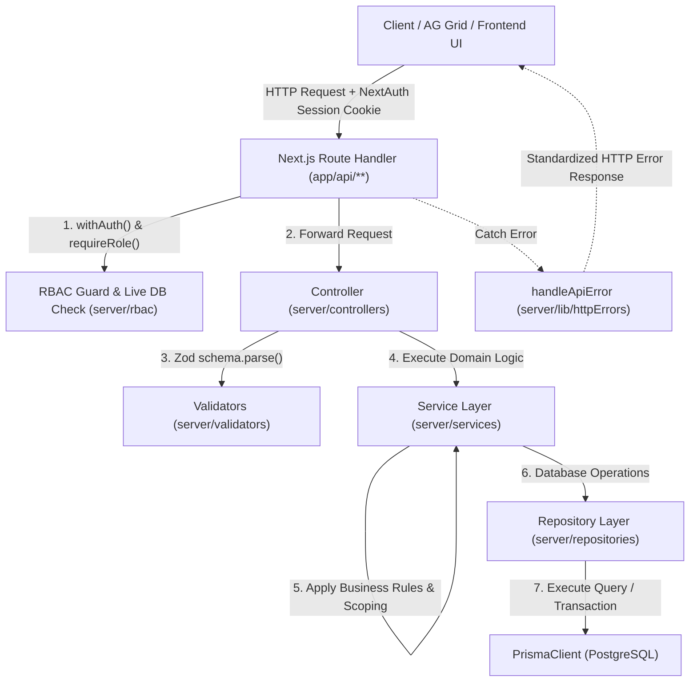
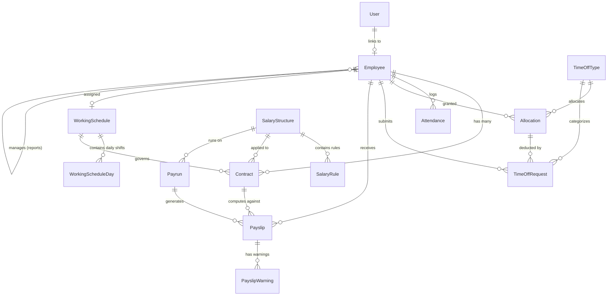
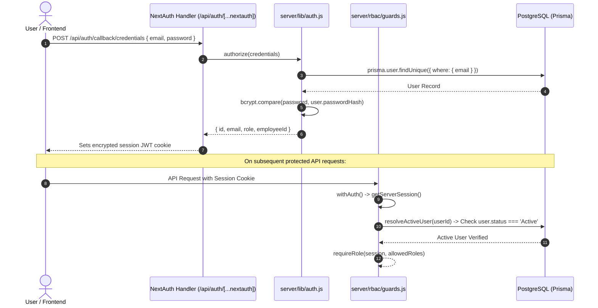
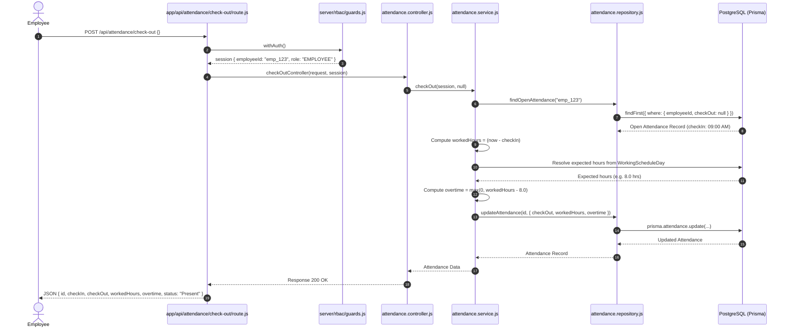
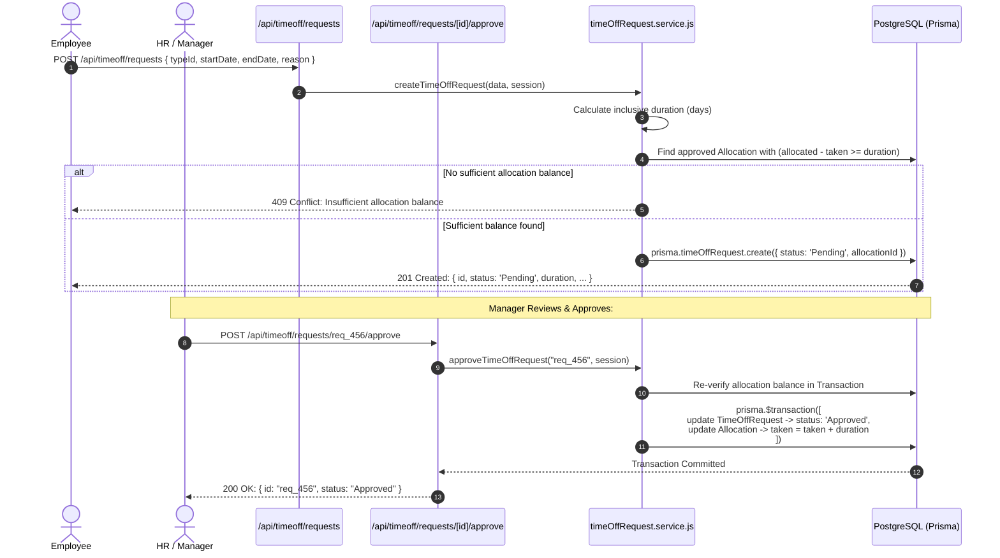
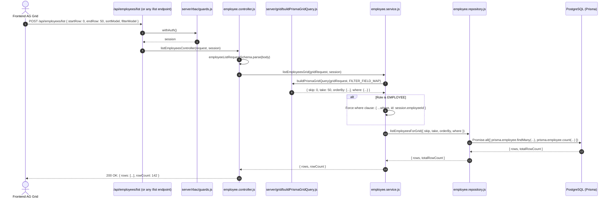

# PeoplePay360 Backend — Architecture, Folder Structure & API Flow Documentation

> **Project:** PeoplePay360 Backend (HR & Payroll Management System)  
> **Framework:** Next.js 16 (App Router, JavaScript / ESM)  
> **Database / ORM:** PostgreSQL + Prisma ORM 7 (`prisma-client-js`)  
> **Authentication:** NextAuth.js v4 (JWT Strategy, Credentials Provider, Bcrypt)  
> **Grid Engine:** AG Grid Server-side Infinite Row Model integration  

---

## 1. Complete Lowest-Level Folder & File Structure

Below is the complete file tree down to every single file and directory in `peoplepay360-backend/`:

```
peoplepay360-backend/
├── .env.example                               # Sample environment variables (DATABASE_URL, NEXTAUTH_SECRET, etc.)
├── .gitignore                                 # Git ignore patterns (node_modules, .next, .env, etc.)
├── AGENTS.md                                  # Agent instructions and Next.js Dev environment notices
├── CLAUDE.md                                  # Developer assistant guidelines
├── README.md                                  # Default Next.js template readme
├── eslint.config.mjs                          # ESLint configuration
├── jsconfig.json                              # JavaScript path aliases (@/* -> ./*)
├── next.config.mjs                            # Next.js build and runtime configuration
├── package.json                               # Dependencies, scripts, and package metadata
├── package-lock.json                          # Lockfile for npm dependencies
├── postcss.config.mjs                         # PostCSS configuration with Tailwind CSS v4
├── prisma.config.mjs                          # Prisma 7 datasource & database connection configuration
├── proxy.js                                   # Reverse proxy / dev server helper script
│
├── app/                                       # Next.js App Router root
│   ├── favicon.ico                            # Favicon asset
│   ├── globals.css                            # Global CSS and Tailwind CSS setup
│   ├── layout.js                              # Root React layout component
│   ├── page.js                                # Default root page
│   │
│   └── api/                                   # REST API Route Handlers
│       ├── attendance/                        # Attendance module endpoints
│       │   ├── route.js                       # (Not used / modularized into child routes)
│       │   ├── check-in/
│       │   │   └── route.js                   # POST: Quick employee check-in
│       │   ├── check-out/
│       │   │   └── route.js                   # POST: Quick employee check-out & hours/overtime calculation
│       │   ├── current/
│       │   │   └── route.js                   # GET: Auto-detect active open attendance session
│       │   ├── list/
│       │   │   └── route.js                   # POST: AG Grid infinite row model query for attendance records
│       │   └── [id]/
│       │       └── route.js                   # GET (details), PATCH (HR correction), DELETE (delete attendance)
│       │
│       ├── auth/                              # Authentication module
│       │   └── [...nextauth]/
│       │       └── route.js                   # GET/POST: NextAuth.js credentials handler & session endpoints
│       │
│       ├── contracts/                         # Contracts module endpoints
│       │   ├── route.js                       # POST: Create a new contract
│       │   ├── list/
│       │   │   └── route.js                   # POST: AG Grid infinite row model query for contracts
│       │   └── [id]/
│       │       └── route.js                   # GET (details), PATCH (update contract), DELETE (delete contract)
│       │
│       ├── employees/                         # Employees module endpoints
│       │   ├── route.js                       # POST: Create a new employee
│       │   ├── list/
│       │   │   └── route.js                   # POST: AG Grid infinite row model query for employees
│       │   ├── options/
│       │   │   └── route.js                   # GET: Dropdown options list (id, label)
│       │   └── [id]/
│       │       ├── route.js                   # GET (details + smart button counts), PATCH (update), DELETE (delete)
│       │       └── contracts/
│       │           └── route.js               # POST: Employee Form smart button — contracts for specific employee
│       │
│       ├── timeoff/                           # Time Off module endpoints
│       │   ├── allocations/                   # Leave allocations
│       │   │   ├── route.js                   # POST: Create allocation
│       │   │   ├── list/
│       │   │   │   └── route.js               # POST: AG Grid infinite query for allocations (includes remaining balance)
│       │   │   └── [id]/
│       │   │       └── route.js               # GET (details), PATCH (update/approve/refuse), DELETE (delete)
│       │   ├── requests/                      # Leave requests
│       │   │   ├── route.js                   # POST: Create time off request (validates balance & bounds)
│       │   │   ├── list/
│       │   │   │   └── route.js               # POST: AG Grid infinite query for time off requests
│       │   │   └── [id]/
│       │   │       ├── route.js               # GET (details), DELETE (delete request)
│       │   │       ├── approve/
│       │   │       │   └── route.js           # POST: Approve request (atomically updates allocation taken balance)
│       │   │       └── refuse/
│       │   │           └── route.js           # POST: Refuse request
│       │   └── types/                         # Time off types configuration
│       │       ├── route.js                   # POST: Create time off type
│       │       ├── list/
│       │       │   └── route.js               # POST: AG Grid infinite query for time off types
│       │       ├── options/
│       │       │   └── route.js               # GET: Dropdown options list for time off types
│       │       └── [id]/
│       │           └── route.js               # GET (details), PATCH (update), DELETE (delete)
│       │
│       ├── users/                             # User management endpoints (Admin only)
│       │   ├── route.js                       # GET: List all users, POST: Create user linked to employee
│       │   └── [id]/
│       │       └── route.js                   # PATCH: Update user status or role (blocks self-role change)
│       │
│       └── working-schedules/                 # Working schedules module endpoints
│           ├── route.js                       # POST: Create working schedule with daily shifts
│           ├── list/
│           │   └── route.js                   # POST: AG Grid infinite query for working schedules
│           ├── options/
│           │   └── route.js                   # GET: Dropdown options list for working schedules
│           └── [id]/
│               └── route.js                   # GET (details with days), PATCH (update), DELETE (delete)
│
├── prisma/                                    # Prisma Database Schema & Migrations
│   ├── schema.prisma                          # Complete Prisma database models, relations, enums
│   ├── seed.js                                # Database seeder script for initial demo data
│   └── migrations/                            # PostgreSQL migration history
│       ├── migration_lock.toml                # Prisma migration engine lockfile
│       ├── 20260905074950_init/               # Migration: Initial User & Role schema
│       │   └── migration.sql
│       ├── 20260905080336_add_employee/       # Migration: Employee model & relations
│       │   └── migration.sql
│       ├── 20260905081858_add_working_schedule_contract/ # Migration: WorkingSchedule & Contract models
│       │   └── migration.sql
│       ├── 20260905083718_add_attendance/     # Migration: Attendance tracking model
│       │   └── migration.sql
│       └── 20260905084849_add_timeoff_salary_payroll_schema/ # Migration: TimeOff, SalaryStructure, Payroll models
│           └── migration.sql
│
├── public/                                    # Static assets
│   ├── file.svg
│   ├── globe.svg
│   ├── next.svg
│   ├── vercel.svg
│   └── window.svg
│
└── server/                                    # Backend core architecture (Clean Layered Pattern)
    ├── controllers/                           # HTTP Controllers: Unpack request, validate schemas, call service
    │   ├── allocation.controller.js           # Time off allocation HTTP handlers
    │   ├── attendance.controller.js           # Attendance & check-in/out HTTP handlers
    │   ├── contract.controller.js             # Employment contract HTTP handlers
    │   ├── employee.controller.js             # Employee CRUD & smart button HTTP handlers
    │   ├── timeOffRequest.controller.js       # Time off request & approve/refuse HTTP handlers
    │   ├── timeOffType.controller.js          # Time off type HTTP handlers
    │   ├── user.controller.js                 # User management HTTP handlers
    │   └── workingSchedule.controller.js      # Working schedule HTTP handlers
    │
    ├── grid/                                  # AG Grid Infinite Row Model query builder
    │   ├── grid.schema.js                     # Zod schema for AG Grid requests (startRow, endRow, sortModel, filterModel)
    │   └── buildPrismaGridQuery.js            # Query translator from AG Grid model to Prisma (skip, take, orderBy, where)
    │
    ├── lib/                                   # Shared core utilities & infrastructure
    │   ├── auth.js                            # NextAuth options, Credentials Provider & JWT/Session callbacks
    │   ├── httpErrors.js                      # Custom error classes (NotFoundError, ConflictError, ValidationError) & handleApiError
    │   └── prisma.js                          # PrismaClient singleton instance
    │
    ├── rbac/                                  # Role-Based Access Control
    │   ├── roles.js                           # ROLES enum and PERMISSION_MATRIX mapping modules to allowed roles
    │   └── guards.js                          # withAuth, requireRole, resolveActiveUser (live DB active-check)
    │
    ├── repositories/                          # Data Access Layer: Direct Prisma DB queries & transactions
    │   ├── allocation.repository.js           # DB queries for Allocation model
    │   ├── attendance.repository.js           # DB queries for Attendance model
    │   ├── contract.repository.js             # DB queries for Contract model (including overlap queries)
    │   ├── employee.repository.js             # DB queries for Employee model (including relation counts)
    │   ├── timeOffRequest.repository.js       # DB queries for TimeOffRequest model & approval transactions
    │   ├── timeOffType.repository.js          # DB queries for TimeOffType model
    │   ├── user.repository.js                 # DB queries for User model
    │   └── workingSchedule.repository.js      # DB queries for WorkingSchedule & WorkingScheduleDay models
    │
    ├── services/                              # Business Logic Layer: Computations, invariants, business rules
    │   ├── allocation.service.js              # Allocation logic (computes remaining balance)
    │   ├── attendance.service.js              # Attendance logic (auto check-in/out, overtime computation against schedule)
    │   ├── contract.service.js                # Contract logic (no-overlap invariant for running contracts)
    │   ├── employee.service.js                # Employee logic (smart buttons, data isolation for EMPLOYEE role)
    │   ├── timeOffRequest.service.js          # TimeOff logic (balance verification, atomic deduction on approval)
    │   ├── timeOffType.service.js             # TimeOffType management logic
    │   ├── user.service.js                    # User creation & role update logic (prevents self-demotion/promotion)
    │   └── workingSchedule.service.js         # Working schedule logic (automatic shift hours & weekly totals calculation)
    │
    └── validators/                            # Input validation schemas (Zod)
        ├── allocation.validator.js            # Create/update schemas for allocations
        ├── attendance.validator.js            # Check-in, check-out, and correction schemas
        ├── contract.validator.js              # Create/update schemas for contracts
        ├── employee.validator.js              # Create/update schemas for employees
        ├── timeOffRequest.validator.js        # Create schema for time off requests
        ├── timeOffType.validator.js           # Create/update schemas for time off types
        ├── user.validator.js                  # Create/update schemas for users
        └── workingSchedule.validator.js       # Create/update schemas for working schedules & daily shifts
```

---

## 2. System Architecture & Layered Design

The backend implements a **Clean Layered Architecture** with strict separation of concerns:



### Layer Breakdown

1. **Route Handler Layer (`app/api/**/route.js`)**:
   - Acts as the HTTP endpoint gateway.
   - Enforces authentication (`withAuth()`) and authorization (`requireRole()`).
   - Forwards request data to the controller.
   - Wraps execution in `try / catch` and delegates errors to `handleApiError(err)`.

2. **RBAC & Security Layer (`server/rbac/*`)**:
   - `resolveActiveUser(userId)`: Re-checks user existence and `status === 'Active'` against PostgreSQL on **every request**. If an admin deactivates an account, their token is immediately rejected without waiting for JWT expiration.
   - `requireRole(session, allowedRoles)`: Compares user role against permitted roles defined in `server/rbac/roles.js`.

3. **Controller Layer (`server/controllers/*.js`)**:
   - Extracts JSON body / query params / URL dynamic parameters.
   - Validates incoming data using **Zod** schemas.
   - Invokes appropriate Service methods.
   - Formats HTTP response (`200 OK`, `201 Created`, `204 No Content`).

4. **Validator Layer (`server/validators/*.js`)**:
   - Defines strict input shapes, string lengths, regex patterns (e.g. `HH:mm` times), enum constraints, and ISO date formatting.
   - Shared grid request schema (`startRow`, `endRow`, `sortModel`, `filterModel`).

5. **Service Layer (`server/services/*.js`)**:
   - Encapsulates all domain and business rules.
   - Enforces data isolation: users with the `EMPLOYEE` role are strictly scoped to `session.employeeId` (they cannot query or modify other employees' records).
   - Computes derived values:
     - `workingSchedule.service.js`: Computes shift hours `((endTime - startTime) - breakMinutes)` and `totalWeeklyHours`.
     - `attendance.service.js`: Computes `workedHours` and `overtime` against the employee's assigned `WorkingScheduleDay`.
     - `contract.service.js`: Validates that no overlapping `Running` contracts exist for an employee.
     - `timeOffRequest.service.js`: Verifies quota balance and executes atomic deduction during approval.
     - `allocation.service.js`: Computes dynamically derived `remaining = allocated - taken`.

6. **Repository Layer (`server/repositories/*.js`)**:
   - Pure database access methods using Prisma.
   - Supports relational filtering, includes (`_count`, nested relations), and transactions (`prisma.$transaction`).

7. **Data Grid Layer (`server/grid/*`)**:
   - `buildPrismaGridQuery()` translates AG Grid Infinite Row Model pagination, sorting, and multi-column filtering directly into Prisma query clauses (`skip`, `take`, `orderBy`, `where`).

8. **Error Handling (`server/lib/httpErrors.js`)**:
   - Central error mapper producing consistent JSON `{ error: message, details?: [...] }` with standardized HTTP status codes:
     - `401 Unauthorized`: Not logged in or account inactive.
     - `403 Forbidden`: Insufficient role or accessing another employee's private record.
     - `400 Bad Request`: Zod validation failure or domain validation error.
     - `404 Not Found`: Entity does not exist.
     - `409 Conflict`: Business invariant violation (e.g., overlapping contracts, insufficient leave balance, double check-in).
     - `500 Internal Server Error`: Uncaught exceptions.

---

## 3. Database Models & Schema Relationships

The schema is defined in `prisma/schema.prisma` and contains 5 distinct sub-systems:



### Detailed Entities Breakdown

| Model | Key Fields | Responsibilities & Relations |
|---|---|---|
| **User** | `id`, `email`, `passwordHash`, `role`, `status`, `employeeId` | System authentication and RBAC. 1-to-1 optional link to `Employee`. |
| **Employee** | `id`, `name`, `email`, `status`, `department`, `jobPosition`, `managerId`, `workingScheduleId` | Master record for HR. Links to User, Manager, Direct Reports, Contracts, Attendances, Leaves, and Payslips. |
| **WorkingSchedule** | `id`, `name`, `calendarType`, `totalWeeklyHours`, `status` | Weekly work calendar. Holds collection of `WorkingScheduleDay` records. |
| **WorkingScheduleDay** | `id`, `workingScheduleId`, `day` (MON..SUN), `startTime`, `endTime`, `breakMinutes`, `hours` | Daily shift hours. Used to calculate expected daily working hours and overtime. |
| **Contract** | `id`, `employeeId`, `startDate`, `endDate`, `wage`, `workingScheduleId`, `salaryStructureId`, `status` | Employment contract details. Enforces single `Running` contract per employee time range. |
| **Attendance** | `id`, `employeeId`, `checkIn`, `checkOut`, `workedHours`, `overtime`, `status`, `correctedBy` | Real-time attendance. Computes worked duration and overtime against schedule. |
| **TimeOffType** | `id`, `name`, `unit` (Days/Hours), `requiresAllocation`, `approvalRole`, `status` | Leave categories (e.g. Paid Leave, Sick Leave, Unpaid Leave). |
| **Allocation** | `id`, `employeeId`, `typeId`, `allocated`, `taken`, `status`, `validFrom`, `validTo` | Leave balance granted to an employee. `remaining` is computed dynamically (`allocated - taken`). |
| **TimeOffRequest** | `id`, `employeeId`, `typeId`, `startDate`, `endDate`, `duration`, `allocationId`, `status` | Employee leave applications. Validates against available allocation before approval. |
| **SalaryStructure** | `id`, `name`, `active` | Base container for salary calculation rules. |
| **SalaryRule** | `id`, `structureId`, `code`, `name`, `category`, `sequence`, `computationMethod`, `formula` | Salary breakdown formulas (Basic, Allowances, Gross, Deductions, Net). |
| **Payrun** | `id`, `name`, `structureId`, `periodStart`, `periodEnd`, `status` | Batch payroll processing cycle (Draft, Validated, Paid). |
| **Payslip** | `id`, `payrunId`, `employeeId`, `contractId`, `workedDays`, `basic`, `gross`, `net`, `lines` | Individual employee payslip computation with JSON rule snapshot. |

---

## 4. Role-Based Access Control (RBAC) Matrix

Roles defined in `server/rbac/roles.js`:
- `EMPLOYEE`
- `HR_MANAGER`
- `HR_PAYROLL_USER`
- `HR_PAYROLL_MANAGER`
- `ADMIN`

| Module / Resource | EMPLOYEE | HR_MANAGER | HR_PAYROLL_USER | HR_PAYROLL_MANAGER | ADMIN |
|---|:---:|:---:|:---:|:---:|:---:|
| **User Management** | ❌ No Access | ❌ No Access | ❌ No Access | ❌ No Access | ✅ Full CRUD |
| **Employees** | 👁️ Own Record Only | ✅ Full CRUD | ✅ Full CRUD | ✅ Full CRUD | ✅ Full CRUD |
| **Contracts** | 👁️ Own Record Only | ✅ Full CRUD | ✅ Full CRUD | ✅ Full CRUD | ✅ Full CRUD |
| **Working Schedules** | 👁️ Own Schedule Only | ✅ Full CRUD | ✅ Full CRUD | ✅ Full CRUD | ✅ Full CRUD |
| **Attendance** | ⏱️ Check In/Out (Own) | ✅ Full CRUD + Corrections | ✅ Full CRUD | ✅ Full CRUD | ✅ Full CRUD |
| **Time Off Types** | 👁️ Read Only | ✅ Full CRUD | ✅ Full CRUD | ✅ Full CRUD | ✅ Full CRUD |
| **Allocations** | 👁️ Own Allocations Only | ✅ Full CRUD | ✅ Full CRUD | ✅ Full CRUD | ✅ Full CRUD |
| **Time Off Requests** | ✍️ Submit / Read Own | ✅ Full CRUD + Approve/Refuse | ✅ Full CRUD | ✅ Full CRUD | ✅ Full CRUD |
| **Salary Structures / Rules**| ❌ No Access | ❌ No Access | 👁️ Read Only | ✅ Full CRUD | ✅ Full CRUD |
| **Payruns** | ❌ No Access | ❌ No Access | ✍️ Create/Read/Update | ✅ Full CRUD | ✅ Full CRUD |
| **Payslips** | 👁️ Own Payslips Only | ❌ No Access | ✍️ Create/Read/Update | ✅ Full CRUD | ✅ Full CRUD |
| **Payroll Dashboard** | ❌ No Access | 👁️ Read Only | 👁️ Read Only | 👁️ Read Only | 👁️ Read Only |

---

## 5. Detailed API Flow & Request Lifecycles

### Flow 1: Authentication & Session Verification


---

### Flow 2: Quick Attendance Check-In / Check-Out


---

### Flow 3: Time Off Request & Atomic Approval Flow


---

### Flow 4: AG Grid Infinite Row Model List & Scoping Flow


---

## 6. Comprehensive API Endpoint Reference

### 6.1 Authentication Module (`/api/auth`)

| Endpoint | Method | RBAC Roles | Description | Request Body / Query | Response |
|---|---|---|---|---|---|
| `/api/auth/[...nextauth]` | `GET`, `POST` | Public | NextAuth handler for login, logout, CSRF token, and session polling | `{ email, password }` for credentials login | Session token / user session JSON |

---

### 6.2 User Management Module (`/api/users`) — Admin Only

| Endpoint | Method | RBAC Roles | Description | Request Body | Response |
|---|---|---|---|---|---|
| `/api/users` | `GET` | `ADMIN` | List all user accounts in system | None | `Array<User>` (without passwordHash) |
| `/api/users` | `POST` | `ADMIN` | Create user account linked to employee | `{ email, password, role, employeeId, status? }` | `201 Created`: User JSON |
| `/api/users/[id]` | `PATCH` | `ADMIN` | Update user status or role (blocks changing self-role) | `{ status?, role? }` | `200 OK`: Updated User JSON |

---

### 6.3 Employees Module (`/api/employees`)

| Endpoint | Method | RBAC Roles | Description | Request Body / Query | Response |
|---|---|---|---|---|---|
| `/api/employees` | `POST` | Non-Employee Roles | Create new employee profile | `{ name, email, department?, jobPosition?, workLocation?, company?, workingScheduleId?, managerId?, status? }` | `201 Created`: Employee JSON |
| `/api/employees/list` | `POST` | All (EMPLOYEE scoped) | Infinite grid query with sorting & filters | `{ startRow, endRow, sortModel, filterModel }` | `200 OK`: `{ rows: Employee[], rowCount: number }` |
| `/api/employees/options`| `GET` | All Authenticated | Get id & name for dropdown selectors | None | `200 OK`: `Array<{ id, label }>` |
| `/api/employees/[id]` | `GET` | All (EMPLOYEE own only)| Get full employee details + smart button counts | None | `200 OK`: Employee + `smartButtonCounts` |
| `/api/employees/[id]` | `PATCH` | Non-Employee Roles | Update employee profile | Partial employee schema | `200 OK`: Updated Employee JSON |
| `/api/employees/[id]` | `DELETE`| Non-Employee Roles | Delete employee record | None | `204 No Content` |
| `/api/employees/[id]/contracts`| `POST` | All (EMPLOYEE own only)| List contracts for this specific employee | `{ startRow, endRow, sortModel, filterModel }` | `200 OK`: `{ rows: Contract[], rowCount: number }` |

---

### 6.4 Working Schedules Module (`/api/working-schedules`)

| Endpoint | Method | RBAC Roles | Description | Request Body | Response |
|---|---|---|---|---|---|
| `/api/working-schedules` | `POST` | Non-Employee Roles | Create working schedule (auto-calculates hours) | `{ name, calendarType?, company?, status?, days: [{ day, startTime, endTime, breakMinutes }] }` | `201 Created`: WorkingSchedule with days |
| `/api/working-schedules/list` | `POST` | All (EMPLOYEE own only)| Infinite grid query for working schedules | `{ startRow, endRow, sortModel, filterModel }` | `200 OK`: `{ rows: WorkingSchedule[], rowCount: number }` |
| `/api/working-schedules/options`| `GET` | All Authenticated | Dropdown list of active schedules | None | `200 OK`: `Array<{ id, label }>` |
| `/api/working-schedules/[id]` | `GET` | All (EMPLOYEE own only)| Get schedule details with all daily shifts | None | `200 OK`: WorkingSchedule + days |
| `/api/working-schedules/[id]` | `PATCH` | Non-Employee Roles | Update schedule details / shift hours | Partial working schedule schema | `200 OK`: Updated WorkingSchedule |
| `/api/working-schedules/[id]` | `DELETE`| Non-Employee Roles | Delete working schedule | None | `204 No Content` |

---

### 6.5 Contracts Module (`/api/contracts`)

| Endpoint | Method | RBAC Roles | Description | Request Body | Response |
|---|---|---|---|---|---|
| `/api/contracts` | `POST` | Non-Employee Roles | Create contract (validates no running overlap) | `{ employeeId, department?, jobPosition?, startDate, endDate?, wage, workingScheduleId?, salaryStructureId?, status?, notes? }` | `201 Created`: Contract JSON |
| `/api/contracts/list` | `POST` | All (EMPLOYEE own only)| Infinite grid query for contracts | `{ startRow, endRow, sortModel, filterModel }` | `200 OK`: `{ rows: Contract[], rowCount: number }` |
| `/api/contracts/[id]` | `GET` | All (EMPLOYEE own only)| Get single contract details | None | `200 OK`: Contract JSON |
| `/api/contracts/[id]` | `PATCH` | Non-Employee Roles | Update contract (re-validates overlap) | Partial contract schema | `200 OK`: Updated Contract JSON |
| `/api/contracts/[id]` | `DELETE`| Non-Employee Roles | Delete contract | None | `204 No Content` |

---

### 6.6 Attendance Module (`/api/attendance`)

| Endpoint | Method | RBAC Roles | Description | Request Body | Response |
|---|---|---|---|---|---|
| `/api/attendance/check-in` | `POST` | All (Self or on-behalf)| Start open attendance session | `{ employeeId? }` (EMPLOYEE always checks in self) | `201 Created`: Attendance session |
| `/api/attendance/check-out`| `POST` | All (Self or on-behalf)| Close open session, compute hours & overtime | `{ employeeId? }` | `200 OK`: Attendance record with workedHours & overtime |
| `/api/attendance/current` | `GET` | All Authenticated | Get status of current active check-in session | None | `200 OK`: `{ isOpen: boolean, attendance: Attendance \| null }` |
| `/api/attendance/list` | `POST` | All (EMPLOYEE own only)| Infinite grid query for attendance records | `{ startRow, endRow, sortModel, filterModel }` | `200 OK`: `{ rows: Attendance[], rowCount: number }` |
| `/api/attendance/[id]` | `GET` | All (EMPLOYEE own only)| Get attendance record details | None | `200 OK`: Attendance JSON |
| `/api/attendance/[id]` | `PATCH` | Non-Employee Roles | Manual correction of hours/times by HR | `{ checkIn?, checkOut?, status?, notes? }` | `200 OK`: Corrected Attendance JSON |
| `/api/attendance/[id]` | `DELETE`| Non-Employee Roles | Delete attendance record | None | `204 No Content` |

---

### 6.7 Time Off Module (`/api/timeoff`)

#### Types (`/api/timeoff/types`)
| Endpoint | Method | RBAC Roles | Description | Request Body | Response |
|---|---|---|---|---|---|
| `/api/timeoff/types` | `POST` | Non-Employee Roles | Create leave type | `{ name, unit?, requiresAllocation?, approvalRole?, payrollWorkEntry?, color?, status? }` | `201 Created`: TimeOffType JSON |
| `/api/timeoff/types/list` | `POST` | All Authenticated | Infinite grid query for time off types | `{ startRow, endRow, sortModel, filterModel }` | `200 OK`: `{ rows: TimeOffType[], rowCount: number }` |
| `/api/timeoff/types/options`| `GET` | All Authenticated | Dropdown list of active leave types | None | `200 OK`: `Array<{ id, label }>` |
| `/api/timeoff/types/[id]` | `GET` | All Authenticated | Get time off type details | None | `200 OK`: TimeOffType JSON |
| `/api/timeoff/types/[id]` | `PATCH` | Non-Employee Roles | Update time off type | Partial TimeOffType schema | `200 OK`: Updated TimeOffType |
| `/api/timeoff/types/[id]` | `DELETE`| Non-Employee Roles | Delete time off type | None | `204 No Content` |

#### Allocations (`/api/timeoff/allocations`)
| Endpoint | Method | RBAC Roles | Description | Request Body | Response |
|---|---|---|---|---|---|
| `/api/timeoff/allocations` | `POST` | Non-Employee Roles | Allocate leave quota to employee | `{ employeeId, typeId, allocated, description?, validFrom?, validTo?, status? }` | `201 Created`: Allocation with `remaining` balance |
| `/api/timeoff/allocations/list`| `POST` | All (EMPLOYEE own only)| Infinite grid query for allocations | `{ startRow, endRow, sortModel, filterModel }` | `200 OK`: `{ rows: (Allocation & { remaining })[], rowCount }` |
| `/api/timeoff/allocations/[id]`| `GET` | All (EMPLOYEE own only)| Get allocation details + remaining | None | `200 OK`: Allocation + `remaining` |
| `/api/timeoff/allocations/[id]`| `PATCH` | Non-Employee Roles | Update allocation status or amount | Partial allocation schema | `200 OK`: Updated Allocation |
| `/api/timeoff/allocations/[id]`| `DELETE`| Non-Employee Roles | Delete allocation | None | `204 No Content` |

#### Requests (`/api/timeoff/requests`)
| Endpoint | Method | RBAC Roles | Description | Request Body | Response |
|---|---|---|---|---|---|
| `/api/timeoff/requests` | `POST` | All (Submit own or on-behalf)| Submit leave request (validates quota) | `{ employeeId?, typeId, startDate, endDate, reason? }` | `201 Created`: TimeOffRequest JSON |
| `/api/timeoff/requests/list` | `POST` | All (EMPLOYEE own only)| Infinite grid query for requests | `{ startRow, endRow, sortModel, filterModel }` | `200 OK`: `{ rows: TimeOffRequest[], rowCount: number }` |
| `/api/timeoff/requests/[id]` | `GET` | All (EMPLOYEE own only)| Get leave request details | None | `200 OK`: TimeOffRequest JSON |
| `/api/timeoff/requests/[id]` | `DELETE`| Non-Employee Roles | Delete leave request | None | `204 No Content` |
| `/api/timeoff/requests/[id]/approve`| `POST` | Non-Employee Roles | Approve leave & atomically deduct allocation quota | None | `200 OK`: Approved TimeOffRequest |
| `/api/timeoff/requests/[id]/refuse` | `POST` | Non-Employee Roles | Refuse leave request | None | `200 OK`: Refused TimeOffRequest |

---

## 7. Key Invariants & Business Logic Rules

1. **Security & Live Revocation**:
   - Every protected route verifies that the database user is currently active (`resolveActiveUser`). Deactivated users cannot execute requests even with a valid unexpired JWT.
   - Users are prohibited from elevating their own role via `user.service.js`.

2. **Employee Isolation**:
   - A user with the `EMPLOYEE` role is permanently restricted to their own `session.employeeId`. Any query or mutation targeting another employee's record is blocked with `403 Forbidden`.

3. **Contract Non-Overlap Guarantee**:
   - An employee cannot have two `Running` contracts with overlapping date periods. The system checks all active contracts on creation and modification, rejecting conflicts with `409 Conflict`.

4. **Working Schedule Auto-Computation**:
   - The client never dictates `hours` or `totalWeeklyHours`. Shift hours are derived automatically by subtracting `breakMinutes` from `endTime - startTime`.

5. **Attendance Overtime Derivation**:
   - On `check-out`, the system matches the check-in weekday against the employee's assigned `WorkingScheduleDay`. If the worked duration exceeds the scheduled daily shift, the surplus is logged into the `overtime` column.

6. **Time Off Allocation Invariant**:
   - If a leave type requires allocation (`requiresAllocation === true`), submitting a request requires an approved allocation with sufficient balance (`allocated - taken >= duration`). On approval, `taken` is incremented atomically inside a database transaction.
